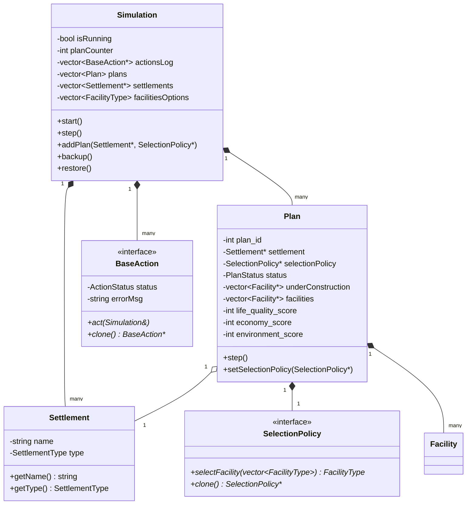
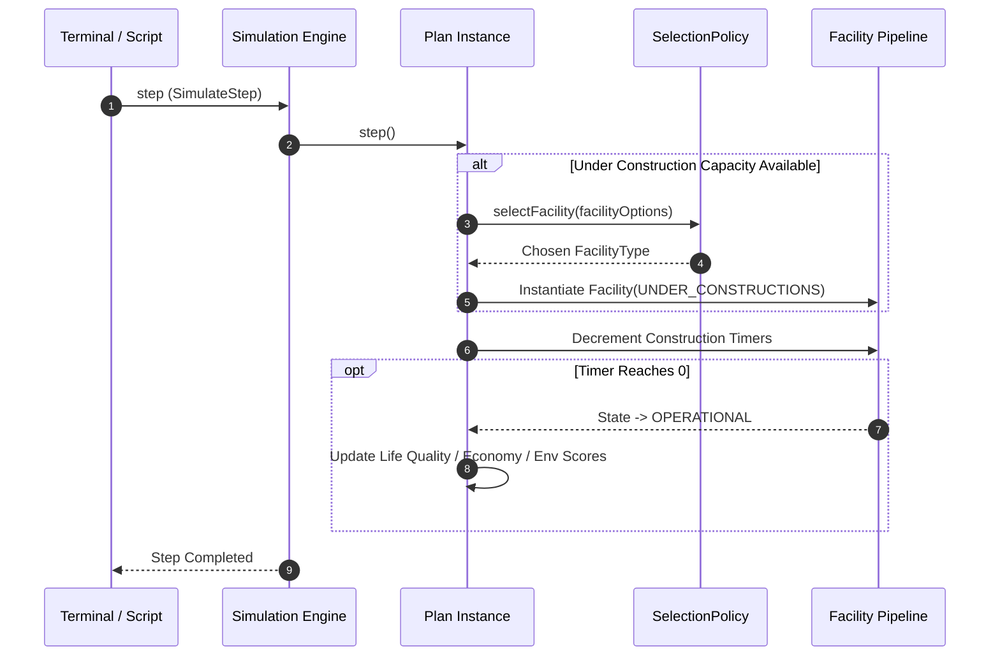

# SPL Project 1 — Settlement Simulation Engine

[](https://en.cppreference.com/)
[](https://www.gnu.org/software/make/)
[](https://refactoring.guru/design-patterns)
[](https://en.cppreference.com/w/cpp/language/rule_of_three)
[](LICENSE)

> 📚 **Part of a 3-project series** from the Systems Programming Lab course at **Ben-Gurion University of the Negev**
> [SPL1 — Settlement Simulation](https://github.com/Nitay321/SPL1) · [SPL2 — Concurrent Microservices](https://github.com/Nitay321/SPL2) · [SPL3 — Real-Time Messaging System](https://github.com/Nitay321/SPL3)

An object-oriented discrete simulation engine written in modern C++, modeling municipal infrastructure development across tiered settlements (Villages, Cities, Metropolises). Implements the **Strategy** and **Command** design patterns for pluggable construction policies, transactional action execution, and full in-memory state snapshot and rollback mechanics.

---

## 📋 Table of Contents

- [Overview](#-overview)
- [Key Features](#-key-features)
- [Architecture & Design Patterns](#-architecture--design-patterns)
  - [Domain Model & Class Hierarchy](#domain-model--class-hierarchy)
  - [Strategy Pattern: Selection Policies](#strategy-pattern-selection-policies)
  - [Command Pattern: Action System](#command-pattern-action-system)
- [Memory Management & Rule of Five](#-memory-management--rule-of-five)
- [System Workflow](#-system-workflow)
- [Project Structure](#-project-structure)
- [Building and Running](#-building-and-running)
  - [Prerequisites](#prerequisites)
  - [Compilation](#compilation)
  - [Execution](#execution)
  - [Memory Verification (Valgrind)](#memory-verification-valgrind)
- [Interactive Command Reference](#-interactive-command-reference)
- [Configuration Format](#-configuration-format)
- [License](#-license)

---

## 🌟 Overview

The **Settlement Simulation Engine** simulates municipal expansion across heterogeneous settlements (Villages, Cities, Metropolises). Each settlement manages one or more development plans governed by pluggable selection policies. As the simulation steps forward, plans evaluate available facility blueprints, schedule constructions, progress active build queues, and accumulate holistic regional metrics across **Life Quality**, **Economy**, and **Environment**.

The engine is engineered with strict adherence to systems programming best practices: complete resource encapsulation via RAII, explicit copy/move semantics across polymorphic hierarchies, and non-trivial memory-safe backup and restoration workflows.

---

## ⚡ Key Features

- **Tiered Municipal Hierarchy:**
  - `Village`: Limited infrastructure capacity (maximum 1 concurrent plan).
  - `City`: Moderate infrastructure capacity (maximum 2 concurrent plans).
  - `Metropolis`: High-density capacity (maximum 3 concurrent plans).

- **Multi-Metric Facility Lifecycle:**
  - Facilities feature realistic build durations, construction states (`UNDER_CONSTRUCTIONS`, `OPERATIONAL`), and multidimensional impact scores (`Life Quality`, `Economy`, `Environment`).
  - Separation between immutable catalog specifications (`FacilityType`) and active municipal instances (`Facility`).

- **Dynamic Strategy Selection Policies:**
  - Four distinct algorithms governing facility selection for construction plans, fully swappable at runtime without interrupting active queues.

- **Transactional Command Execution:**
  - Decoupled commands encapsulating simulation state modifications, parameter parsing, error logging, and formatted output generation.

- **Full Simulation Snapshot & Rollback:**
  - Deep-copy state backup (`backup`) and atomic rollback (`restore`), enabling checkpointing and non-destructive branch testing.

- **Zero-Leak Memory Safety:**
  - Strict adherence to the **Rule of Five** (Destructor, Copy Constructor, Copy Assignment, Move Constructor, Move Assignment) for robust pointer ownership and deep cloning.

---

## 🏗️ Architecture & Design Patterns

The engine's architecture emphasizes decoupling, open-closed extensibility, and explicit memory ownership.



---

### Strategy Pattern: Selection Policies

Facility selection logic is isolated into interchangeable strategy objects deriving from `SelectionPolicy`. This allows plans to adjust their growth trajectories on-the-fly via the `ChangePlanPolicy` action.

| Policy | Strategy Identifier | Evaluation Metric | Behavior |
| :--- | :--- | :--- | :--- |
| **Naive Selection** | `nve` | Sequential (Round-Robin) | Selects the next facility option in cyclic order, irrespective of current score profiles. |
| **Balanced Selection** | `bal` | Metric Equilibrium | Selects facilities that minimize the disparity between `Life Quality`, `Economy`, and `Environment` scores. |
| **Economy Selection** | `eco` | Economic Maximization | Prioritizes facilities yielding the highest economy boost per construction cycle. |
| **Sustainability Selection** | `env` | Environmental Protection | Exclusively selects facilities with positive environmental footprints, mitigating degradation. |

Each policy implements a virtual `clone()` method to facilitate polymorphic deep copying when plans or simulation states are duplicated.

---

### Command Pattern: Action System

All user interactions and simulation commands inherit from `BaseAction`, encapsulating operational logic, validation, error diagnostics, and history logging.

- **`AddSettlement`**: Registers a new municipal node with predefined capacity boundaries.
- **`AddFacility`**: Injects new architectural specifications into the available blueprints catalog.
- **`AddPlan`**: Links a settlement with an initial selection policy to instantiate a construction pipeline.
- **`SimulateStep`**: Advances global simulation time, ticking construction timers and triggering policy decisions.
- **`ChangePlanPolicy`**: Dynamically replaces an active plan's selection algorithm at runtime.
- **`PrintPlanStatus`**: Reports granular plan status, active construction pipelines, and composite scores.
- **`PrintActionsLog`**: Dumps an audit trail of all executed commands and their completion statuses (`COMPLETED` / `ERROR`).
- **`BackupSimulation`**: Creates a full in-memory snapshot of the simulation state.
- **`RestoreSimulation`**: Rolls back the entire simulation state to the latest valid backup.

---

## 🛡️ Memory Management & Rule of Five

Because the simulation manages dynamic polymorphic objects (`SelectionPolicy*`, `Settlement*`, `Facility*`, `BaseAction*`), manual memory management is handled with surgical precision to ensure leak-free operation and pointer safety:

1. **Polymorphic Deep Copying:**
   Abstract classes (`SelectionPolicy`, `BaseAction`) expose virtual `clone()` methods, avoiding object slicing during vector reallocations and snapshot operations.

2. **The Rule of Five:**
   State-bearing classes managing raw pointers (`Simulation`, `Plan`, and concrete policies) implement:
   - **Destructor:** Clean traversal and reclamation of owned heap objects.
   - **Copy Constructor:** Deep replication of dynamic resources.
   - **Copy Assignment Operator (`operator=`):** Exception-safe copy-and-swap idiom to avoid memory leaks during assignment.
   - **Move Constructor:** Resource theft without unnecessary allocations.
   - **Move Assignment Operator:** Rapid ownership transfer and cleanup of displaced pointers.

3. **Safe Snapshot / Rollback Mechanism:**
   The `BackupSimulation` and `RestoreSimulation` actions clone the entire heap graph of the running simulation into a standalone backup pointer (`backupSimulation`), ensuring that subsequent modifications do not corrupt the restore point.

---

## 🔄 System Workflow



---

## 📁 Project Structure

```text
.
├── bin/                       # Compiled executable binaries
├── include/                   # Header declarations (.h)
│   ├── Action.h               # BaseAction and concrete command declarations
│   ├── Facility.h             # Facility and FacilityType models
│   ├── Plan.h                 # Construction plan and lifecycle manager
│   ├── SelectionPolicy.h      # Strategy interface and concrete selection policies
│   ├── Settlement.h           # Settlement entity and tier definitions
│   └── Simulation.h           # Central simulation controller and state holder
├── src/                       # Source code implementations (.cpp)
│   ├── Action.cpp             # Command execution logic and validation
│   ├── Facility.cpp           # Facility instantiation and state transitions
│   ├── Plan.cpp               # Planning progress, score aggregation, deep copies
│   ├── SelectionPolicy.cpp    # Implementation of selection algorithms
│   ├── Settlement.cpp         # Settlement behavior and capacity verification
│   ├── Simulation.cpp         # Engine loop, config parser, backup/restore
│   └── main.cpp               # Entry point and interactive command loop
├── config_input.txt           # Sample initial configuration file
├── makefile                   # Build configuration with automated dependency tracking
└── README.md                  # System documentation
```

---

## 🚀 Building and Running

### Prerequisites

- **Compiler:** GCC / G++ supporting C++11 or higher (C++14 recommended)
- **Build Tool:** GNU Make
- **Debugger / Profiler (Optional):** Valgrind (Linux / WSL)

### Compilation

Compile the project using the optimized Makefile:

```bash
# Build the simulation executable into bin/
make

# Clean build artifacts (object files and binaries)
make clean
```

### Execution

Launch the compiled executable by providing a path to an initial configuration file:

```bash
./bin/simulation config_input.txt
```

### Memory Verification (Valgrind)

To confirm zero leaks and zero memory errors across complex action chains:

```bash
valgrind --leak-check=full --show-leak-kinds=all --track-origins=yes ./bin/simulation config_input.txt
```

Expected output:
```text
==XXXXX== ERROR SUMMARY: 0 errors from 0 contexts (suppressed: 0 from 0)
==XXXXX== All heap blocks were freed -- no leaks are possible
```

---

## ⌨️ Interactive Command Reference

Once the simulation starts, commands can be entered via standard input (`stdin`):

| Command Syntax | Arguments | Description | Example |
| :--- | :--- | :--- | :--- |
| `step` | `<number_of_steps>` | Advances the simulation by $N$ tick cycles. | `step 3` |
| `plan` | `<settlement_name> <policy>` | Registers a new plan for an existing settlement. | `plan Metropolis_A bal` |
| `settlement` | `<name> <type>` | Adds a new settlement (`0`=Village, `1`=City, `2`=Metropolis). | `settlement Zion 2` |
| `facility` | `<name> <cat> <cost> <life> <eco> <env>` | Adds a new facility blueprint to the catalog. | `facility SolarPlant 1 100 2 5 10` |
| `planStatus` | `<plan_id>` | Displays status, active builds, and scores for a plan. | `planStatus 0` |
| `changePolicy` | `<plan_id> <new_policy>` | Switches the policy of a plan (`nve`, `bal`, `eco`, `env`). | `changePolicy 0 eco` |
| `log` | *none* | Prints chronological log of executed actions and statuses. | `log` |
| `backup` | *none* | Creates an in-memory snapshot of the simulation state. | `backup` |
| `restore` | *none* | Restores the engine state from the last backup. | `restore` |
| `close` | *none* | Gracefully terminates the engine and frees all allocated memory. | `close` |

---

## ⚙️ Configuration Format

The configuration file (e.g., `config_input.txt`) bootstraps the simulation world before the interactive loop begins:

```text
# Define Settlements: settlement <name> <type: 0|1|2>
settlement Greenfield 0
settlement Riverdale 1
settlement MetropolisPrime 2

# Define Facilities: facility <name> <category> <price> <lifeQuality> <economy> <environment>
facility Park 0 50 10 0 5
facility Factory 1 150 -5 20 -10
facility WaterTreatment 2 100 5 5 15

# Define Initial Plans: plan <settlement_name> <policy: nve|bal|eco|env>
plan Greenfield nve
plan Riverdale bal
plan MetropolisPrime eco
```

---

## 📄 License

Distributed under the MIT License. See `LICENSE` for more information.
